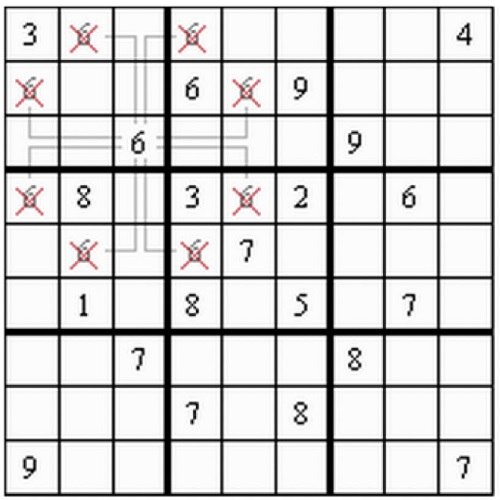
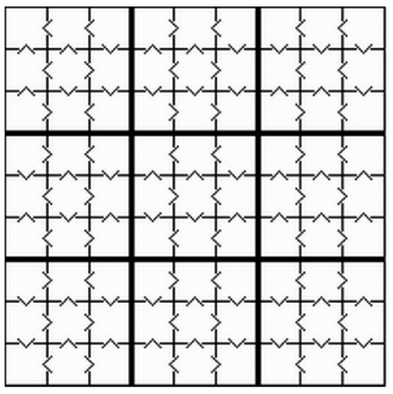

# ASP Beginner Clingo Programs
- This is a small repository which might help anyone get started with **answer set programming (ASP)** using **Clingo (v5.4.0)**.
- The solution for these programs can be found in **[Programming-Solutions](Programming-Solutions)**.
- Details on the problem statements can be found in **[Clingo_Programming](Clingo_Programming.pdf)**.
- Details on how to run the programs and my output of the programs and my implementation can be found in **"[How_to_Run_and_Output](How_to_Run_and_Output.pdf)"**

## Problem 1. 
Use clingo to find all solutions to the 8 queens problem that have no queens in the 4x4=16
squares in the middle of the board.  

## Problem 2. 
Use clingo to find all solutions to the n-queens problem for n=3,4,5,6,7,8,9,10,11,12. Draw a
table that lists the number of solutions and the times to compute all solutions. Use CPU time
that clingo returns. Since the output is large, do not copy them into the submission. 

## Problem 3. 
Use clingo to find all solutions to the so-called world's hardest sudoku problem below. 

 
 
 
 
## Problem 4. 
Use clingo to find all solutions to the 16x16 Sudoku problem below. 

 
 
 
 
 
 
## Problem 5. 
Use clingo to find all solutions to the Offset Sudoku problem below. 

 
 
 
 
 
 
 
 
## Problem 6. 
Use clingo to find all solutions to the Anti-Knight Sudoku problem presented below.
{:height="500px" width="500px"}
 
 
 
 
 
 
 
 
## Problem 7. 
Use clingo to find all solutions to the Greater-Than Sudoku problem presented below.
{:height="500px" width="501px"}
 
 
 
 
 
 
 
## Problem 8. 
Use clingo to determine how many bishops can be placed on a chessboard so that they do not
attack each other.
(a) Find the maximum value of bishops when the chessboard is n by n, where n is 3, 4, 5, 6, 7,
8.
(b) Infer the general function f(n) that returns the maximum value of bishops.  

## Problem 9. 
About a set X of numbers we say that it is almost sum-free if the sum of two different elements
of X never belongs to X. For instance, the set {1, 2, 4} is almost sum-free. Almost-Schur number
A(k) is the largest integer n for which the interval {1, . . . , n} can be partitioned into k almost
sum-free sets.
Use clingo to find the exact values of A(1), A(2), A(3) and try to find the largest lower bound for
A(4), i.e., the largest number l such that A(4) ≥ l.
Hint:
 you do not need to find all partitions to find the values of A(k). 
​